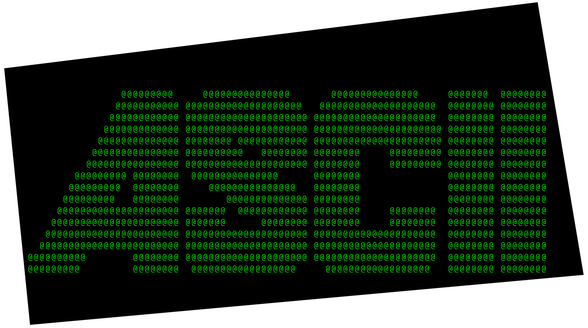

# ASCII Art Tool - Matrix Edition

<p align="center">
  
</p>

A stylish, interactive tool for converting images to ASCII art, with live filter controls and a Matrix-inspired look. Draw your own images, tweak filters, and copy the result with ease!

---

## Features

- **Image to ASCII**: Load any image and instantly convert it to ASCII art.
- **Live Filters**: Adjust grayscale, invert, blur, brightness, and contrast with real-time preview.
- **Draw Mode**: Create your own image with a brush/eraser and variable thickness.
- **Matrix Theme**: Green-on-black UI inspired by The Matrix.
- **Copy to Clipboard**: One-click copy of your ASCII masterpiece.
- **Responsive Layout**: Filters panel on the left, output on the right.

---

## Requirements

- Python 3.8+
- [Pillow](https://pypi.org/project/Pillow/) (`pip install pillow`)

No other dependencies are required. Tkinter is included with most Python installations.

---

## How to Run

1. Install Pillow if you haven't:
   ```
   pip install pillow
   ```
2. Run the tool:
   ```
   python asciiArtTool.py
   ```

---

## Usage

- **Open Image**: Load an image file to convert.
- **Draw Image**: Open a drawing window. Use the brush or eraser, adjust thickness, then convert to ASCII.
- **Filters**: Toggle and adjust filters on the left. The ASCII art updates live.
- **Copy to Clipboard**: Copies the ASCII art for use elsewhere.

---

## Technical Details

- **Image Processing**: Uses Pillow for resizing, grayscale, and filter effects.
- **ASCII Mapping**: Each pixel's brightness is mapped to a character in `@%#*+=-:. `.
- **Live Update**: Changing any filter or parameter instantly refreshes the ASCII output.
- **Drawing**: The draw window uses a PIL image as a canvas, synced with the Tkinter canvas for real-time drawing and erasing.
- **UI**: Tkinter frames organize the layout. Custom colors and fonts create the Matrix vibe.

---

## Credits

- © 2025 Ascii Art Tool by DrJunkHoofd

---
